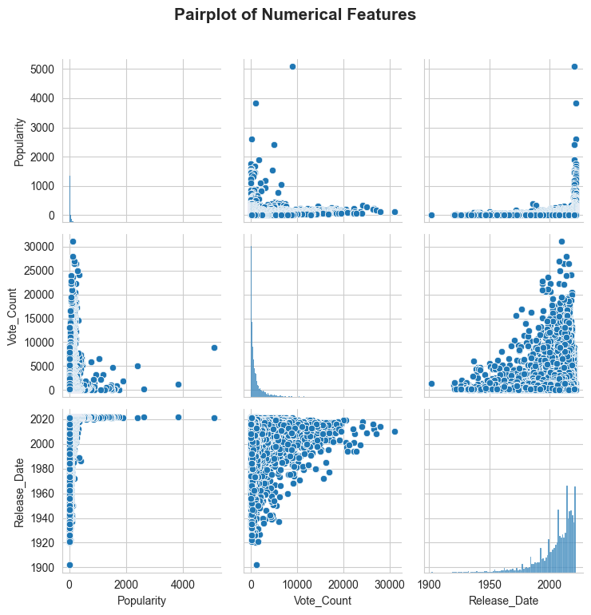

# 🎬 Netflix Movie Dataset Analysis 🚀
**Unlocking insights from Netflix movie data with Python & Jupyter Notebook!**  

_**✨A comprehensive data cleaning, analysis, and visualization journey.✨**_


---

This project undertakes detailed data cleaning, exploratory data analysis (EDA), and visualization of a comprehensive Netflix movies dataset. The analysis reveals key trends in genres, release years, popularity, and voting patterns using Python libraries such as Pandas, NumPy, Matplotlib, and Seaborn.

***

## ✨ Project Overview

The dataset contains 9,827 movie records with 9 attribute columns related to Netflix movies. This project aims to clean the data, transform it for analysis, and reveal patterns and insights through detailed visualizations and statistical summaries. The dataset includes movies spanning several decades, allowing an exploration of genre popularity over time as well as viewer ratings and popularity metrics.The project mainly focuses on: 

- Release year trends
- Genre distribution and explosion to individual genres
- Categorization of vote averages into popularity groups
- Popularity and vote count distributions
- Relationships between popularity, votes, genres, and release years
- Visualizations with bar charts, histograms, heatmaps, scatterplots, violin plots, and area charts
- The goal is to draw actionable insights into Netflix’s movie landscape and its evolution over time.

***

## 🛠 Technology Stack & Libraries

- **Python 3.9**: Core programming language for data analysis
- **Pandas**: Data loading, cleaning, transformation, and aggregation
- **NumPy**: Numerical operations and array handling
- **Matplotlib & Seaborn**: Advanced visualization libraries providing a wide variety of plots (bar charts, histograms, heatmaps, scatterplots, violin plots, etc.)

***

## 🗂 Data Pipeline & Methodology

### 1. Data Loading and Initial Exploration

- Loaded the `.csv` file (`mymoviesdb.csv`) specifying the newline character as the line terminator for accurate parsing.
- Displayed initial rows and column data types.
- Checked for missing or duplicate entries—none found, indicating tidy initial data.

### 2. Data Cleaning & Preparation

- Converted the **Release_Date** string to a datetime object and extracted only the **year** as an integer for temporal analysis.
- Removed non-informative columns: `Overview`, `Original_Language`, and `Poster_Url` that do not aid numerical or categorical analysis.
- Transformed the **Vote_Average** into four ordered categories based on quartiles: `not_popular` (lowest), `below_avg`, `average`, and `popular` (highest) using a custom function `categorize_col()`. This facilitates easier categorical analysis.
- Processed the **Genre** column—initially a comma-separated string list per movie—by splitting into lists, then exploding so each movie-genre pair occupies its own row. This allows genre-level granularity. The column was then cast to the categorical datatype to optimize performance and memory.
- Dropped any residual missing or null data after transformations.

### 3. Exploratory Data Analysis (EDA) & Visualization

The heart of the project; includes a broad range of analyses and charts:

#### Univariate Analysis

- Count and descriptive statistics of **Genres**.
- **Bar charts and pie charts** illustrating the distribution of movie genres.
- **Histograms** of movie production by year exposing release volume trends.
- Count plots for categorized **Vote_Average** groups.
- Histograms of **Vote_Count** and **Popularity** showing skewness and frequency.

#### Bivariate Analysis

- Scatter plot illustrating the correlation between **Vote_Count** and **Popularity** metrics.
- Heatmap and stacked bar chart visualizations of the number of movies per genre per release year.
- Boxplots comparing popularity within genres grouped by vote average category.
- Count plot showing frequency of each genre split by vote average popularity.

#### Multivariate Analysis

- FacetGrid plots showing **Popularity by Year** for each genre separately.
- Violin plots visualizing **Popularity distributions** for vote average categories split by genre.
- Horizontal bar chart with a color gradient showing top 10 most popular movies.
- Area charts showing proportional shifts in genre compositions over time.

### 4. Advanced Statistical Analysis

- Descriptive statistics by genre for popularity and vote count.
- Correlation matrix heatmap displaying relationships among `Popularity`, `Vote_Count`, and `Release_Date` (year).
- Pairplot of numerical features for visual correlation and distribution analysis.

***

## 📁 Dataset Structure (Post-Cleaning)

| Column        | Description                                         |
|---------------|-----------------------------------------------------|
| Release_Date  | Year the movie was released (integer)              |
| Title         | Movie title                                         |
| Popularity    | Numeric popularity score                            |
| Vote_Count    | Number of user votes                                |
| Vote_Average  | Categorized vote average — popularity bands         |
| Genre         | Individual genre per row (categorical)             |

***

## 📈 Key Visualizations

---

### **🎭 Genre Distribution**

- Displays frequency of each genre via bar and pie charts, highlighting Comedy, Drama, and Action as dominant genres.


---

### **📅 Movies Released Per Year**

- Histogram and line chart expose the trend in Netflix movie production, with spikes in select years, notably around 2020.


---

### **⭐ Vote Average Distribution**

- Count plot showing how movies are categorized by popularity bands.


---

### **📊 Vote Count vs Popularity**

- Scatterplot revealing strong relations but skewed distributions.


---

### **🎬 Movies per Genre Year-Wise**

- Heatmap and stacked bar chart uncover how different genres rose or declined over time.


---

### **🏆 Top 10 Popular Movies**

- Horizontal bar chart uses a color gradient to rank movies by highest popularity.


---

### **📈 Proportional Genre Composition Over Time**

- Area charts illustrate shifting genre popularity percentages annually.


---

### **🔍 Correlation Matrix and Pairplots**

- Statistical explorations showing associations among key numeric variables.




***

## 💡 Key Insights

- Netflix’s movie catalog is heavily weighted toward **Drama**, **Comedy**, and **Action** genres.
- Movie releases show **yearly fluctuations** with a notable production increase around 2020.
- Popularity and vote counts show **long-tail, right-skewed** distributions indicating a few movies dominate in popularity.
- The categorization of vote averages uncovers that about 25% of movies fall into the “popular” bucket.
- **Spider-Man: No Way Home** ranks as one of the highest popularity movies, representing multiple genres.
- Popularity varies within genres as shown in boxplots, revealing nuances by vote category.
- Correlation analysis shows a **strong positive link between Vote Count and Popularity**, but a weaker association between release year and other metrics.
- Genre analysis over years reveals shifts: Action and Thriller gain popularity at certain periods, while Drama remains relatively steady.

***

## 🚀 How to Run This Project

1. **Clone the repo:**
    ```
    git clone https://github.com/your-username/netflix-movie-analysis.git
    cd netflix-movie-analysis
    ```
2. **Install required packages:**
    ```
    pip install numpy pandas matplotlib seaborn jupyter
    ```
3. **Add the data file:**  
   Place `mymoviesdb.csv` in the project directory.
4. **Start the notebook:**
    ```
    jupyter notebook
    ```
    Open `Netflix_Movie_Analysis.ipynb` and run all cells!

***

## 🤝 Contribution & Feedback

Contributions, issue reporting, and suggestions to improve the analysis or reporting are welcome. Open pull requests or issues on the repository.

***

## 🙏 Acknowledgments

- Netflix and public data sources for movie data.
- Python open source libraries (Pandas, NumPy, Matplotlib, Seaborn) that make this analysis possible.
- Inspiration from Python data science community tutorials and best practices.

***

_Analysis by [Om Jaikumar](https://github.com/omjaikumar23)_  
📝 Built with Jupyter Notebook | 🚀 Happy Exploring!


